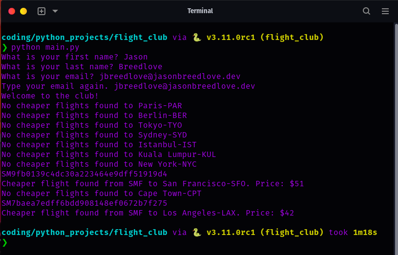

# Flight Deals Finder

## Overview

This Python application automates the process of finding flight deals. It uses various APIs such as the Kiwi API for
flight information, the Sheety API for data storage, and the Twilio API for sending SMS alerts when a cheaper flight is
found.


## Features

- Fetch the IATA code for specific locations.
- Retrieve flight prices for specific routes.
- Store user data and flight details using the Sheety API.
- Send SMS alerts for cheaper flights using the Twilio API.

## Setup & Installation

1. Clone this repository.

```bash
git clone https://github.com/j-breedlove/flight_club.git
```

2. Navigate to the project directory.

```bash
cd flight_club
```

3. Install `pipenv` if you haven't already:

```bash
pip install pipenv
```

4. Use `pipenv` to create a virtual environment and install dependencies:

```bash
pipenv install
```

5. Activate the virtual environment:

```bash
pipenv shell
```

6. Set up your environment variables in a `.env` file at the root of the project. Use the provided `.env.template` as a
   guide.
7. Run the main script:

```bash
python main.py
```

## Contributing

Pull requests are welcome. For major changes, please open an issue first to discuss what you would like to change.

## License

[MIT](https://choosealicense.com/licenses/mit/)
